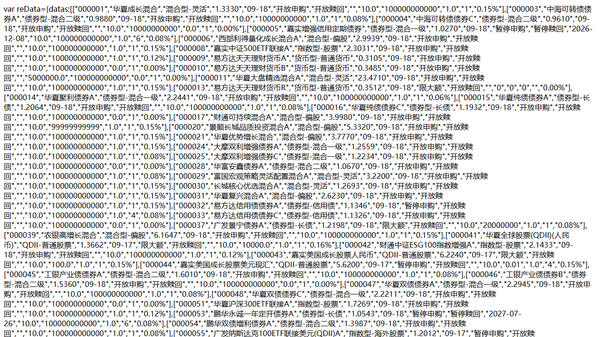
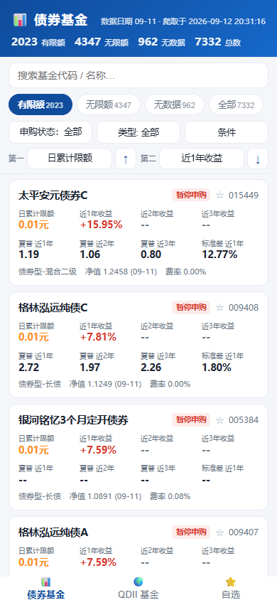
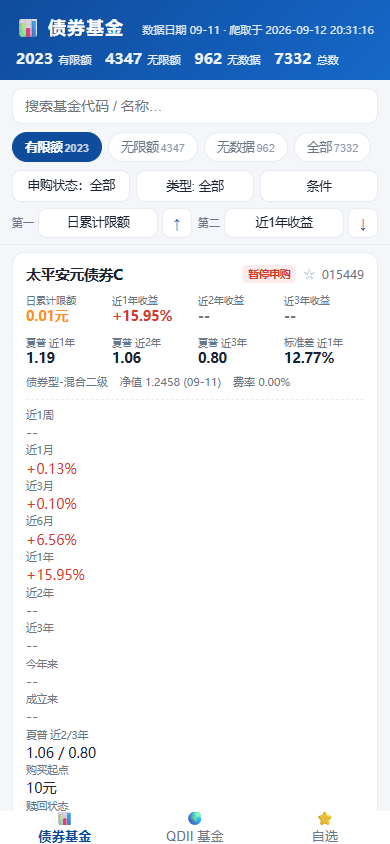
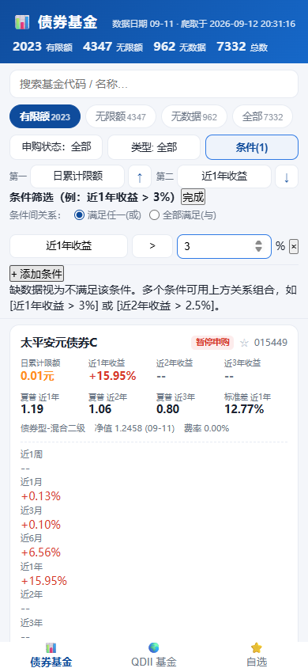
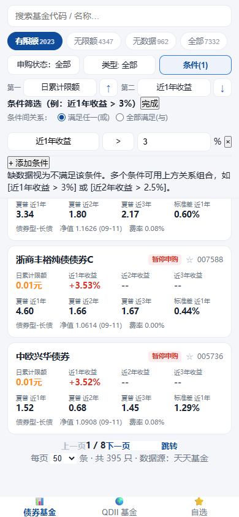
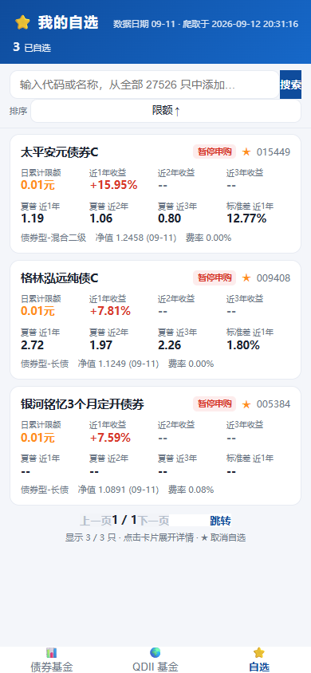
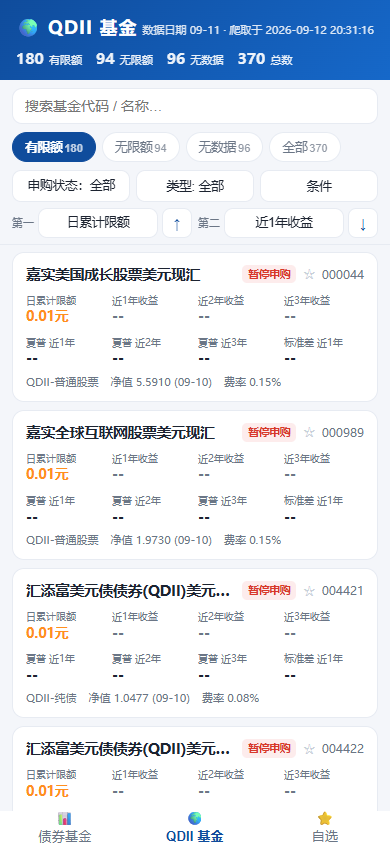

# 我花了 0 元，把 27000 只基金塞进了手机桌面

> 从一次 F12 开始，到爬完 551 页数据、写出 PWA、部署三个平台、再搓出微信小程序——
> 这篇教程把整个过程掰开揉碎讲给你。没有服务器，没花一分钱，每一步都可以照抄。

**先看成品**（都是活的，现在就能点）：

- 🥇 主力：https://fund-radar-cf.pages.dev （Cloudflare Pages + D1）
- 🥈 次选：https://fund-radar-lsm.netlify.app
- 🥉 备用：https://fund-radar-iota.vercel.app

一个手机网页，可以装到桌面当 App 用：27000+ 只基金的申购限额、近1年~成立来收益、夏普比率，
支持多选筛选、自定义条件（比如"近1年收益>3% 或 近2年收益>2.5%"）、两级排序、自选收藏。
对了，还有个微信小程序版。

全程成本：**0 元**。

下面开讲。

---

## 一、金矿就藏在 F12 里

故事 starts with 一个很朴素的需求：东方财富有个页面叫[《开放式基金场外申购状态一览表》](https://fund.eastmoney.com/Fund_sgzt.html)，
上面有所有基金的申购状态和限额。但它一页只有 50 条，500 多页，翻到天荒地老。

按 F12 打开开发者工具，Network 面板翻一页看一眼——

**真香时刻**：页面的数据根本不是写在 HTML 里的，而是前端去请求了一个 JSON 接口：

```
https://fund.eastmoney.com/Data/Fund_JJJZ_Data.aspx?t=8&page=1,50&sort=fcode,asc&js=reData
```

`t=8` 是"申购状态表"，`page=1,50` 是第 1 页每页 50 条。响应长这样：

```
var reData={datas:[["000001","华夏成长混合","混合型-灵活","1.2540","09-11",
"开放申购","开放赎回","","10.0","100000000000","1.0","1","0.15%"],...],
record:"27526",pages:"551"}
```

**27526 只基金，551 页，每只基金 13 个字段。** 密码本拿到了。



> 💡 **心得**：看到一个翻不完的网页表格，先别想着爬 HTML。打开 F12 → Network → XHR，
> 九成概率有个更香的 JSON 接口在等你。爬接口比爬 HTML 干净一万倍。

---

## 二、爬 551 页，要有爬虫的礼仪

接口有了，剩下的是体力活。但体力活也要讲究：

```python
for i in range(1, 552):
    content = fetch(f".../Fund_JJJZ_Data.aspx?t=8&page={i},50&sort=fcode,asc&js=reData")
    open(f"raw/page_{i:03d}.txt", "wb").write(content)
    time.sleep(0.15 + random.random() * 0.15)   # 限速：做个有礼貌的爬虫
```

四个细节，帮我把 551 页一次爬完、零缺漏：

1. **限速 + 随机抖动**：每页间隔 0.15~0.3 秒。人家服务器没欠你的。
2. **重试 + 退避**：失败等 2s、4s、6s 再试，最多 4 次。网络抽风是常态。
3. **断点续传**：已存在的页文件直接跳过。爬到第 400 页断网？重来不用从 1 开始。
4. **完整性校验**：爬完统计每页条数和总数，`551 页累计 27526 条 = 接口声称的总数` 才算过关。

另外一个反直觉的选择：**分页排序用基金代码（fcode），而不是限额字段**。
因为爬 551 页要十几分钟，这期间限额数据可能变动——按值排序翻页会漏数据/重数据，按不变的代码排序就稳如老狗。

> 💡 **心得**：爬虫的可靠性不靠运气，靠"断点续传 + 完整性校验"这两根保险丝。

---

## 三、数据口径的坑，比代码的坑深

拿到 27526 条数据，我以为最难的部分过去了。结果最大的坑在**业务口径**里。

比如"申购限额"这个字段：大部分基金存的是 `100000000000`（1000 亿）——这是个**哨兵值**，
网页端只要遇到 ≥8 亿的值一律显示"无限额"。暂停申购的基金状态码是空的，页面显示 "---"。

所以"有限额"的正确打开方式是照抄原站逻辑：

```
有限额 = 状态代码在 1~10  且  0 ≤ 限额 < 8亿
无限额 = 状态代码在 1~10  且  限额 ≥ 8亿
无数据 = 其他（站点显示 "---"）
```

还有一个反常识的发现：**"开放申购"的基金在数据里全部无限额**，真正限购的基金状态是"限大额"。
如果不看数据瞎按字段名猜，分分钟做出一个错误的筛选器。

> 💡 **心得**：爬数据之前，先花一小时搞清楚"每个字段到底怎么被展示的"。
> 展示逻辑就是数据字典，抄它，别猜它。

---

## 四、变成网页：Vue3 + PWA，手机上像 App 一样

数据有了，接下来做成手机上好用的网页。技术栈选了 **Vite + Vue3 + vite-plugin-pwa**：

- 一个数据接口，全量拉到浏览器，筛选/排序/条件判断全在前端跑（7000 只也就 1MB）；
- PWA 让页面可以**安装到手机桌面**、离线打开，跟原生 App 一个待遇；
- 界面就是三块：底部菜单（债券基金 / QDII 基金 / 自选）、筛选区（分组/状态/类型多选/搜索/条件面板）、
  卡片列表（限额 + 近1/2/3年收益 + 夏普 + 标准差，点开展开九段涨幅）。

打开是这样的，顶部计数、分组标签、筛选区、卡片一屏铺满：



点任何一张卡片，展开九段涨幅 + 购买起点 + 赎回状态等完整档案：



几个我自己觉得好用的功能设计：

**条件筛选器**——不是写死的，是让用户自己组装的：

```
[近1年收益] [>] [3]  或者  [近2年收益] [>] [2.5]
```

指标随便选（限额/各期收益/各期夏普），条件间"满足任一/全部满足"可切换。
实现上就是一个小函数，把条件套在 `filter()` 里，注意"缺数据的基金视为不满足"就行。



**两级排序**——第一排序键 + 第二排序键，各自带升降序。
经典需求"先按夏普排，夏普一样按收益排"，核心十几行：

```js
list.sort((a, b) => {
  for (const [get, asc] of [[primaryGet, pAsc], [secondaryGet, sAsc]]) {
    const va = get(a), vb = get(b);
    if (va === null && vb === null) continue;
    if (va === null) return 1;      // 缺数据永远垫底
    if (vb === null) return -1;
    if (va !== vb) return asc ? va - vb : vb - va;
  }
  return a.code.localeCompare(b.code);
});
```

**分页控件**——早期只有"下拉无限加载"，后来补上了正经的分页器：
上一页/下一页/跳转到任意页/每页条数切换。数据在前端，翻页就是切个切片，零延迟：



**自选收藏**——localStorage 存一堆基金代码，任何列表卡片点个 ☆ 就收藏，
自选页从后端逐只拉详情，还能在自选页里直接搜索全库添加。零后端改动，体验完整。



**QDII 模块**——底部菜单再加一个标签页，复用同一套筛选/排序/卡片组件，
只是数据源换成 `type=QDII`（370 只，美股/全球债/商品/REITs 都有）：



> 💡 **心得**：数据量在几万条以内时，"拉全量到前端 + 本地算"比"后端分页筛选"爽十倍，
> 离线还可用。别一上来就给服务端加一堆查询接口。

---

## 五、最骚的一步：没有服务器，SQLite 怎么办？

这是整个项目我最得意的设计，也是被问最多的：**Vercel/Netlify 免费版的文件系统是临时的，
函数实例随时重建，SQLite 数据库放哪？**

答案简单到离谱：**把数据库当构建产物，提交进 GitHub。**

```
GitHub Actions（每天 01:30 定时跑爬虫）
    ↓ 爬 551 页 → 解析 → 重建 api/db/funds.db
    ↓ git commit + push
Vercel / Netlify 检测到 push → 自动重新部署
    ↓
函数冷启动时从仓库读库（或运行时从 raw.githubusercontent.com 拉最新库）
```

- 爬取 = 定时提交，**天然幂等**，数据无变化就不产生新提交；
- 部署 = git push 自动触发，**零配置 CI/CD**；
- 回滚 = git revert，**每一次历史数据都是一个版本**。

数据新鲜度也解耦了：函数每 6 小时自动从 GitHub 拉最新库，**数据日更不需要重新部署**，
只有改代码才需要。云开发那种"平台绑定数据库"的方案在它面前反而显得重。

> 💡 **心得**：Serverless 平台没有磁盘？那就别用磁盘。git 本身就是最好的免费存储 +
> 版本管理 + 触发器三合一。

---

## 六、三平台踩坑实录（每个平台摔一跤）

**🟧 Netlify：`__dirname` 和 ELF 的双重暴击**

函数里用了 `const __dirname = ...`，结果 Netlify 的打包器自己会注入同名变量 → 重名冲突。
改个名字就好。然后 better-sqlite3 的原生二进制在本地打包时打的是 Windows 版，
传到 Linux 上一跑：`invalid ELF header`。
最后干脆**换成 Node 22 内置的 `node:sqlite`**——零原生依赖，三端通用，天下太平。

**🟧 Vercel：nft 静态追踪的"贴心"陷阱**

本地构建一切正常，部署到远端却报 `lstat /vercel/path0/api/db/funds.db 不存在`。
排查半天发现：Vercel 的依赖追踪器（node-file-trace）会**静态解析**
`path.join(__dirname, 'db', 'funds.db')` 这种字面量，把被 `.vercelignore` 排除的数据库文件
记进部署清单，远端找不到就报错。解法是路径改成运行时拼接（`["db","funds.db"].join(sep)`），
再加个小脚本清洗构建产物里的引用。

**🟧 Cloudflare：换个思路海阔天空**

Workers 运行时不能读文件系统，SQLite 文件方案直接失效。但塞翁失马——
**D1 就是 Cloudflare 官方的 Serverless SQLite**（免费 5GB），数据直接进云数据库：
爬虫每天把增量同步进 D1，函数直接查库，连"下载文件"这一步都省了。

三个平台现在同时在跑，同一个仓库、同一套数据管线，互为备份。

> 💡 **心得**：跨平台部署的坑 90% 来自"平台差异被构建工具悄悄放大"。
> 依赖越少（比如用内置 `node:sqlite` 替代原生模块），坑就越少。

---

## 七、微信小程序：现实主义三连

网页版爽了，但微信生态里小程序才是亲儿子。三个现实问题，三个现实解法：

**1. 原生还是 uni-app？** 我选了原生。理由：今天只需要微信端，uni-app 的多端优势用不上；
原生零构建，导入开发者工具就能跑；业务逻辑抽成平台无关的纯 JS 模块，
以后真要多端，换壳就行。**不为"将来可能"提前付工具链成本。**

**2. request fail 是什么鬼？** 真机预览提示请求失败——因为小程序的 request 合法域名
**必须 ICP 备案**，netlify.app 根本加不进白名单。开发阶段的官方后门：
手机上打开小程序 → 右上角 → 开发调试 → 打开调试，跳过域名校验。
长期方案是接 **`wx.cloud.callFunction`**：云函数在腾讯服务器上转发请求，
走微信自家通道，完全绕开域名白名单（注意云函数返回数据上限 1MB，
全量数据要改成每页 1000 条分页拉取；另外云开发已不免费，最低约 19.9 元/月）。

**3. 正式发布？** 绕不开一个备案域名（几十块/年）。
这是整个项目唯一绕不开的合规成本——开发、体验全免费，上线那步见真章。

---

## 八、账单：0 元，以及我得到的

| 项目 | 方案 | 费用 |
|---|---|---|
| 前端 + API | Cloudflare Pages / Netlify / Vercel 免费档 | 0 |
| 定时爬虫 | GitHub Actions（public 仓库不限时长） | 0 |
| 数据库 | SQLite 入 git + Cloudflare D1 免费档 | 0 |
| PWA / 小程序 | 无需任何账号费用 | 0 |

以及一些写代码之外的东西：学会了看 F12 Network 找接口、理解了"数据口径"的重要性、
把 Serverless 的边界摸了一遍、还白嫖了三个平台的灾备架构。

**完整代码**都在这里，爬虫、构建、部署脚本、小程序一应俱全，star 一下就是交个朋友：
👉 https://github.com/LesslsMore/fund-radar

---

## 写在最后

这个项目最有趣的不是任何一个具体技术点，而是它证明了：

**"没有服务器"不是限制，而是一种架构选择。**

当你的数据量是几 MB 级别、更新频率是"每天一次"、用户是"自己和朋友"时，
把状态放进 git、把计算塞进免费函数、把前端做成 PWA——这套组合拳打完，
你会发现自己根本不需要租任何一台服务器。

如果这篇教程对你有用，把它转给那个总说"想做点东西但没服务器"的朋友吧。

（完）
